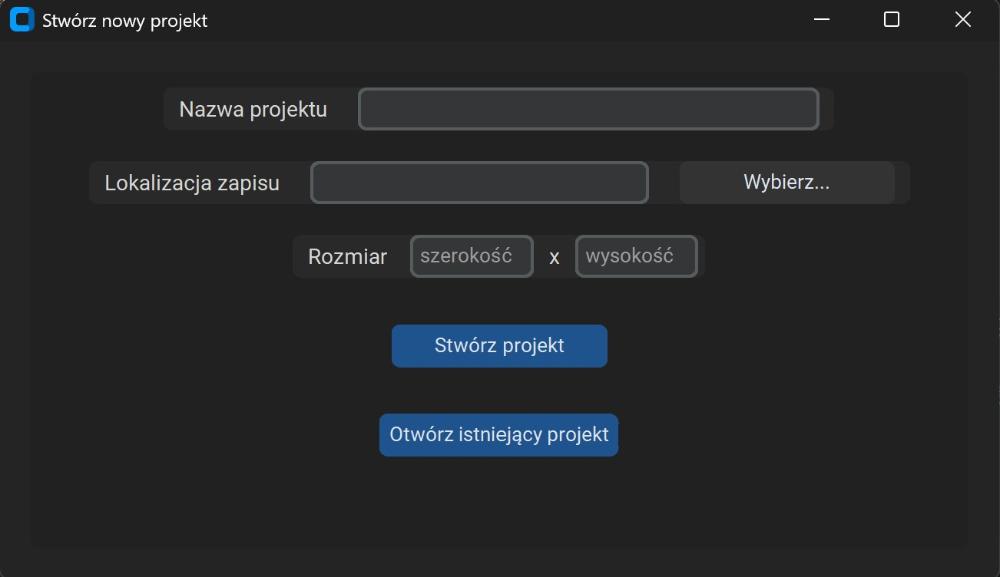
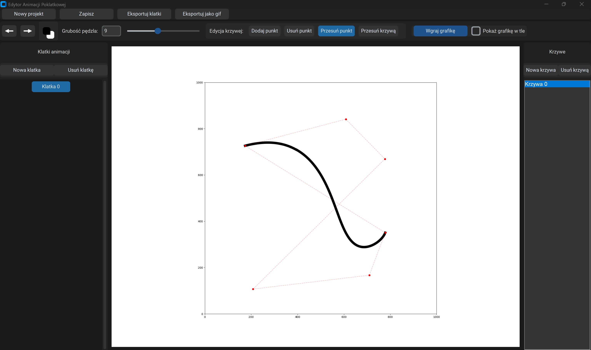

# bezier-stop-motion
Aplikacja do tworzenia animacji poklatkowych za pomocą krzywych Beziera

## Aplikacja:

## Opis plików:

### `main.py`
Główny plik aplikacji.  
Odpowiada za uruchamianie programu, tworzenie i otwieranie projektów, obsługę interfejsu graficznego, edycję krzywych Béziera, zarządzanie klatkami animacji, eksport klatek oraz eksport animacji do formatu GIF.

### `bezier_curve.py`
Moduł odpowiedzialny za obliczanie punktów krzywej Béziera.  
Zawiera funkcje potrzebne do generowania przebiegu krzywej na podstawie punktów kontrolnych.

### `export.py`
Moduł odpowiedzialny za eksport wszystkich klatek animacji do plików PNG.  
Każda klatka zapisywana jest jako osobny obraz w wybranym katalogu projektu.

### `export_index.py`
Moduł odpowiedzialny za eksport pojedynczej wybranej klatki lub wszystkich klatek.  
W projekcie wykorzystywany jest między innymi do generowania podglądu poprzedniej klatki podczas pracy nad animacją.

### `gif.py`
Moduł odpowiedzialny za tworzenie animacji GIF z wcześniej wyeksportowanych klatek PNG.  
Łączy kolejne obrazy w jeden plik GIF o zadanym czasie wyświetlania klatek.

### `save_project.py`
Moduł odpowiedzialny za zapis i odczyt danych projektu.  
Przechowuje informacje o rozmiarze płótna, liście klatek oraz pozostałych danych potrzebnych do ponownego otwarcia projektu.